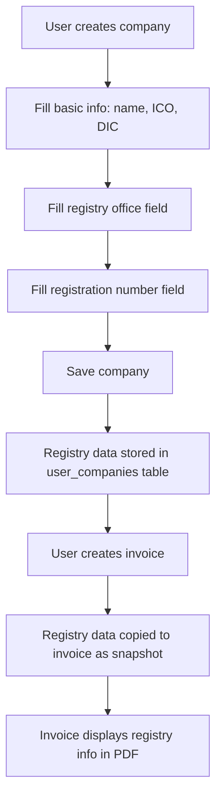

# Company Registry Identification on Invoices - PRD

**Created**: 2025-11-30
**Status**: Draft
**Owner**: Product Manager
**Target Release**: Q1 2025
**Pricing Tier**: All tiers (Free/Basic/Premium/Enterprise)

## 1. Goal

Add mandatory company registry identification fields (registration office and registration number) to invoices in compliance with Slovak accounting legislation, ensuring both UserCompany (supplier) settings and Invoice snapshot storage.

## 2. Target Audience

- **Primary users**: All Slovak business entities issuing invoices (SZCO, s.r.o., a.s., v.o.s., k.s., cooperatives, non-profit organizations)
- **Secondary users**: Accountants and bookkeepers who need legislatively compliant invoices
- **Segment**: All segments (Freelancers / SMB / Accounting firms / Enterprise)
- **Pricing tier**: All packages - this is a legislative requirement

## 3. Problem

### Current solution
Currently, invoices display only basic company identification (ICO, DIC, IC DPH) but lack mandatory registry information required by Slovak accounting legislation.

### Pain points
- Invoices are not fully compliant with Slovak Accounting Act requirements
- Users must manually add registry information to invoice notes or external documents
- Missing standardized format for registry information display
- No structured storage of registry data at company or invoice level

### Competition
- **Fakturoid**: Stores registry office and registration number in company settings, displays on invoices
- **SuperFaktura**: Allows custom fields for registry information
- **Pohoda**: Full support for registry data with automatic display on invoice templates

### Impact of inaction
- Non-compliant invoices may be rejected during accounting audits
- Risk of penalties for missing mandatory information
- Loss of professional credibility
- Potential customer churn to competitors with compliant invoicing

## 4. User Flow

### Main scenario: Adding registry information during company setup



### Alternative scenario 1: Updating existing company
1. User navigates to company settings
2. Updates registry office and/or registration number
3. Saves changes
4. **Existing invoices remain unchanged** (historical accuracy)
5. New invoices use updated registry information

### Alternative scenario 2: Company created during onboarding
1. New user registers account
2. Onboarding flow requests company information
3. User fills registry office and registration number
4. User completes onboarding
5. Company created with registry data

### VAT scenarios
Registry information display is **independent of VAT status**. All company types must display registry identification regardless of:
- VAT payer status (payer/non-payer)
- Section 7 registration
- Reverse charge scenarios
- OSS regime

## 5. Functional Requirements

### REQ-01: UserCompany Model Extension
- **Description**: Add registry_office field to user_companies table
- **Acceptance criteria**:
  - Migration adds `registry_office` column (string, 255 chars, nullable)
  - Column added after `registration_number` for logical grouping
  - UserCompany model includes registry_office in fillable array
  - UserCompany model @property docblock updated
- **Edge cases**:
  - Empty/null values allowed (for backwards compatibility with existing companies)
  - Maximum length validation (255 characters)
- **Error handling**: Validation error if length exceeds 255 characters

### REQ-02: Invoice Snapshot Fields
- **Description**: Add supplier registry snapshot fields to invoices table
- **Acceptance criteria**:
  - Migration adds `supplier_registry_office` column (string, 255 chars, nullable)
  - Migration adds `supplier_registry_number` column (string, 100 chars, nullable)
  - Columns added to invoices table for historical preservation
  - Invoice model includes both fields in fillable array
  - Invoice model @property docblock updated
- **Edge cases**:
  - Null values allowed (for invoices created before this feature)
  - Data preserved even if source UserCompany is deleted
- **Error handling**: N/A - snapshot mechanism handles missing data gracefully

### REQ-03: InvoiceCreateAction Snapshot Logic
- **Description**: Copy supplier registry data to invoice during creation
- **Acceptance criteria**:
  - InvoiceCreateAction retrieves supplier_registry_office from UserCompany
  - InvoiceCreateAction retrieves supplier_registry_number from UserCompany
  - Both fields added to $invoiceData array before invoice creation
  - Snapshot created at exact moment of invoice creation
  - Works for both standard and custom company flows
- **Edge cases**:
  - Handle null values if UserCompany lacks registry data
  - Ensure snapshot is transaction-safe (rolled back if invoice creation fails)
- **Error handling**: Transaction rollback on any failure during invoice creation

### REQ-04: InvoiceUpdateAction Exclusion
- **Description**: Ensure registry snapshot fields are NOT updated when invoice is edited
- **Acceptance criteria**:
  - InvoiceUpdateAction does not include supplier_registry_office in update data
  - InvoiceUpdateAction does not include supplier_registry_number in update data
  - Registry snapshot remains immutable after invoice creation
  - Only editable via direct database intervention (for corrections)
- **Edge cases**: N/A - intentional immutability
- **Error handling**: N/A

### REQ-05: Company Creation Form Updates
- **Description**: Add registry fields to company creation forms
- **Acceptance criteria**:
  - CreateCompanyRequest validation includes registry_office (optional, max 255)
  - CreateCompanyRequest validation includes registration_number (unchanged, existing field)
  - Form UI includes text input for registry office
  - Form UI includes text input for registration number
  - Both fields labeled clearly with Slovak terminology
  - Help text explains format expectations
- **Edge cases**:
  - Empty submission allowed (fields are optional)
  - Special characters in registry office name handled correctly
- **Error handling**: Display validation error for length violations

### REQ-06: Onboarding Flow Integration
- **Description**: Collect registry data during user onboarding
- **Acceptance criteria**:
  - RegisterWithCompanyRequest validation includes registry_office (optional, max 255)
  - Onboarding form displays registry office field
  - Onboarding form displays registration number field
  - Fields positioned logically after ICO/DIC/IC DPH section
  - CompanyCreationAction handles registry_office in DTO
- **Edge cases**:
  - User skips registry fields during onboarding (allowed)
  - User can add data later in company settings
- **Error handling**: Validation feedback during onboarding

### REQ-07: PDF Template Display - Classic
- **Description**: Display supplier registry information in classic invoice template
- **Acceptance criteria**:
  - Registry office displayed below IC DPH in supplier section
  - Registration number displayed below registry office
  - Format: Plain text, gray color (#6B7280), 0.75rem font size
  - Conditional rendering: only show if data exists
  - Layout consistent with existing ICO/DIC/IC DPH display
- **Edge cases**:
  - If both fields null, display nothing (no empty labels)
  - If only registry_office null, show only registration_number
  - If only registration_number null, show only registry_office
- **Error handling**: Blade template handles null values gracefully

### REQ-08: PDF Template Display - Modern
- **Description**: Display supplier registry information in modern invoice template
- **Acceptance criteria**:
  - Registry information displayed in supplier identification section
  - Styling consistent with modern template design
  - Conditional rendering matching classic template
- **Edge cases**: Same as REQ-07
- **Error handling**: Same as REQ-07

### REQ-09: PDF Template Display - Minimal
- **Description**: Display supplier registry information in minimal invoice template
- **Acceptance criteria**:
  - Registry information displayed with minimal design aesthetics
  - Conditional rendering matching classic template
- **Edge cases**: Same as REQ-07
- **Error handling**: Same as REQ-07

### REQ-10: PDF Template Display - Bold
- **Description**: Display supplier registry information in bold invoice template
- **Acceptance criteria**:
  - Registry information displayed with bold template styling
  - Conditional rendering matching classic template
- **Edge cases**: Same as REQ-07
- **Error handling**: Same as REQ-07

### REQ-11: InvoiceResource API Response
- **Description**: Include supplier registry data in API responses
- **Acceptance criteria**:
  - InvoiceResource returns supplier_registry_office
  - InvoiceResource returns supplier_registry_number
  - Fields included in invoice detail endpoint
  - Fields included in invoice list endpoint
  - Null values returned as null (not empty strings)
- **Edge cases**: Handle invoices created before this feature (null values)
- **Error handling**: N/A - standard serialization

### REQ-12: CompanyResource API Response
- **Description**: Include registry_office in Company API responses
- **Acceptance criteria**:
  - CompanyResource returns registry_office
  - CompanyMinimalResource returns registry_office
  - UserCompanyResource returns registry_office and registration_number
  - Fields available for frontend consumption
- **Edge cases**: N/A
- **Error handling**: N/A

### REQ-13: Data Migration Support
- **Description**: Ensure existing companies can function without registry data
- **Acceptance criteria**:
  - No required migration for existing user_companies records
  - Existing invoices without snapshot data display correctly
  - No breaking changes to existing invoice PDFs
  - Graceful degradation if data missing
- **Edge cases**:
  - Old invoices render without registry section
  - Mixed state: some invoices with data, some without
- **Error handling**: Template conditionals prevent errors

### REQ-14: Factory and Seeder Updates
- **Description**: Update test data factories to include registry data
- **Acceptance criteria**:
  - UserCompanyFactory generates fake registry_office
  - UserCompanyFactory generates fake registration_number
  - InvoiceFactory includes supplier registry snapshot fields
  - CompanyFactory generates registry data
  - Seeders create realistic test data
- **Edge cases**: Some test cases may require null values (test explicitly)
- **Error handling**: N/A

## 6. Legislative Requirements

### Slovak Accounting Act (Act No. 431/2002 Coll.)
- **Paragraph 10**: Invoices must contain identification of the supplier including registration details
- **Compliance**: Both registry_office and registration_number satisfy identification requirements

### Invoice Content Requirements
All invoices issued by Slovak entities must include:
1. Company name
2. Registered office address
3. ICO (Company ID)
4. **Registration authority and registration number** (this PRD)
5. DIC (Tax ID) if applicable
6. IC DPH (VAT ID) if applicable

### Data Retention
- Invoice snapshots ensure compliance with 10-year archival requirement
- Historical accuracy preserved even if company updates registry information

## 7. System Impact

### Modified components
- **Database**:
  - `user_companies` table: add `registry_office` column
  - `invoices` table: add `supplier_registry_office`, `supplier_registry_number` columns
- **Models**:
  - `UserCompany`: add registry_office to fillable, casts, docblock
  - `Invoice`: add supplier registry fields to fillable, casts, docblock
- **Actions**:
  - `InvoiceCreateAction`: add snapshot logic for supplier registry
  - `CompanyCreationAction`: handle registry_office in DTO
- **DTOs**:
  - `CompanyCreationDTO`: add registry_office property
- **Requests**:
  - `CreateCompanyRequest`: add registry_office validation
  - `RegisterWithCompanyRequest`: add registry_office validation
- **Resources**:
  - `InvoiceResource`: expose supplier registry fields
  - `CompanyResource`: expose registry_office
  - `UserCompanyResource`: ensure registry fields exposed
- **Views**:
  - `invoices/templates/classic.blade.php`: display registry in supplier section
  - `invoices/templates/modern.blade.php`: display registry in supplier section
  - `invoices/templates/minimal.blade.php`: display registry in supplier section
  - `invoices/templates/bold.blade.php`: display registry in supplier section
- **Factories**:
  - `UserCompanyFactory`: generate test registry data
  - `InvoiceFactory`: generate test snapshot data
  - `CompanyFactory`: generate test registry data

### Integrations
- **No external integrations required**
- Internal consistency between UserCompany and Invoice models

### Database
**New columns in user_companies:**
```sql
registry_office VARCHAR(255) NULL
```

**New columns in invoices:**
```sql
supplier_registry_office VARCHAR(255) NULL
supplier_registry_number VARCHAR(100) NULL
```

**Indexes**: None required (read-only display fields)

### API
**Modified endpoints:**
- `GET /api/invoices` - includes supplier registry in response
- `GET /api/invoices/{id}` - includes supplier registry in response
- `GET /api/companies` - includes registry_office in response
- `GET /api/user-companies` - includes registry_office in response
- `POST /api/companies` - accepts registry_office in request
- `PUT /api/companies/{id}` - accepts registry_office in request
- `POST /api/register-with-company` - accepts registry_office in request

## 8. Success Metrics

### Primary metric
- **100% of new invoices** include supplier registry information (if UserCompany has data)
- **Audit compliance rate**: 100% of invoices pass accounting audits for registry information

### Secondary metrics
- **Company profile completion rate**: % of UserCompany records with registry_office populated
- **Onboarding completion**: % of users who fill registry data during registration
- **PDF rendering success**: 0% error rate in invoice PDF generation with registry data

### Business metrics
- **Customer satisfaction**: Increase NPS among accounting firms by 5+ points
- **Support ticket reduction**: 15% reduction in "invoice compliance" related tickets
- **Churn reduction**: Prevent churn from users requiring legislative compliance

## 9. Scope

### In scope
- Add registry_office field to UserCompany model and table
- Add supplier registry snapshot fields to Invoice model and table
- Update InvoiceCreateAction to snapshot supplier registry data
- Display supplier registry in all PDF invoice templates (classic, modern, minimal, bold)
- Update company creation and onboarding forms to collect registry data
- Update API resources to expose registry data
- Update factories and seeders for testing

### Out of scope
- **Foreign company support**: This PRD covers only Slovak entities. Foreign companies will be addressed in a separate PRD
- **Customer (buyer) registry information**: This PRD focuses only on supplier identification
- **Automatic registry lookup via API**: Future enhancement to fetch registry data from business register API
- **Historical data migration**: No automatic population of registry_office for existing companies (user must update manually)
- **Registry format validation**: No validation of registry office/number format (free text entry)
- **Multi-language support**: Registry information displayed in Slovak only
- **Advanced invoice (zaloha)** and **credit note** templates: Will inherit display from standard invoice templates

### Future extensions
- **Phase 2**: Automatic lookup of registry information via Slovak Business Register API
- **Phase 3**: Customer registry information display (buyer identification)
- **Phase 4**: Multi-country support (Czech Republic, other EU states)
- **Phase 5**: Format validation and auto-completion based on company_type (SZCO vs s.r.o.)

### Dependencies
- No blocking dependencies
- This feature can be implemented immediately
- Related to recent VAT status work but independent

## 10. Implementation Handoff

### Architect handoff
This PRD is ready for task breakdown. The architect should create implementation tasks covering:

1. **Database migrations** (user_companies, invoices)
2. **Model updates** (UserCompany, Invoice)
3. **Action layer updates** (InvoiceCreateAction, CompanyCreationAction)
4. **DTO updates** (CompanyCreationDTO)
5. **Request validation** (CreateCompanyRequest, RegisterWithCompanyRequest)
6. **API resources** (InvoiceResource, CompanyResource, UserCompanyResource)
7. **PDF template updates** (all 4 templates)
8. **Factory updates** (UserCompanyFactory, InvoiceFactory, CompanyFactory)
9. **Frontend forms** (company creation, company settings, onboarding)
10. **Testing** (unit tests, feature tests, PDF rendering tests)

### Task folder
`tasks/2025-11-company-registry-identification/`

### Recommended breakdown
**Backend tasks:**
1. `01-migration-user-companies-registry-office.md` - Add registry_office column
2. `02-migration-invoices-supplier-registry.md` - Add supplier snapshot columns
3. `03-model-usercompany-registry.md` - Update UserCompany model
4. `04-model-invoice-supplier-registry.md` - Update Invoice model
5. `05-dto-company-creation-registry.md` - Update CompanyCreationDTO
6. `06-action-invoice-create-snapshot.md` - Snapshot logic in InvoiceCreateAction
7. `07-action-company-creation-registry.md` - Handle registry in CompanyCreationAction
8. `08-request-validation-registry.md` - Add validation rules
9. `09-api-resources-registry.md` - Expose registry in API responses
10. `10-factories-registry-data.md` - Update test factories
11. `11-tests-registry-snapshot.md` - Unit/feature tests

**Frontend tasks:**
12. `12-pdf-template-classic-registry.md` - Display in classic template
13. `13-pdf-template-modern-registry.md` - Display in modern template
14. `14-pdf-template-minimal-registry.md` - Display in minimal template
15. `15-pdf-template-bold-registry.md` - Display in bold template
16. `16-form-company-creation-registry.md` - Add fields to company form
17. `17-form-onboarding-registry.md` - Add fields to onboarding
18. `18-form-company-settings-registry.md` - Add fields to settings
19. `19-tests-pdf-rendering-registry.md` - PDF rendering tests

### Related PRDs
- None (first PRD in this project)

## 11. Agent Session Log

### Session 2025-11-30 14:30 UTC
- **Status**: PRD Draft Completed
- **Pending questions**: None - all requirements confirmed with user
- **Working notes**:
  - Analyzed existing codebase: UserCompany, Company, Invoice models
  - Identified that Company model already has registry_office and registration_number
  - UserCompany model has registration_number but missing registry_office
  - Invoice model missing supplier registry snapshot fields
  - InvoiceCreateAction already implements snapshot pattern for customer data
  - PDF templates display supplier info at lines 12-24 (classic.blade.php)
  - Four PDF templates need updates: classic, modern, minimal, bold
- **Next steps**:
  - PRD ready for architect review
  - Architect to create task breakdown in tasks/ folder
- **Decisions**:
  - Registry data mandatory for all invoice types (legislative requirement)
  - No format validation (free text entry for flexibility)
  - Foreign companies explicitly out of scope
  - Snapshot immutability confirmed (historical accuracy)
  - No automatic data migration for existing companies
  - All 4 PDF templates must be updated for consistency

### Examples Captured from User:

**Registry Office Examples:**
- "Obchodny register Okresneho sudu Bratislava I"
- "Okresny urad Kosice, odbor zivnostenskeho podnikania"

**Registration Number Examples:**
- "Oddiel: Sro, Vlozka c.: 12345/B" (for s.r.o.)
- "Cislo zivnostenskeho registra: 820-12345" (for SZCO)

### Key Technical Insights:

1. **Snapshot Pattern**: Already implemented for customer data in InvoiceCreateAction (lines 80-89), need to extend for supplier registry
2. **Conditional Display**: PDF templates use `@if($invoice->supplierCompany->ic_dph ?? false)` pattern for conditional fields (line 20)
3. **VAT Status**: Templates check `$invoice->supplierCompany->vat_payer_status !== \App\Enums\VatPayerStatus::NOT_VAT_PAYER` for display logic (line 104)
4. **Migration Pattern**: Recent migrations show clear pattern for adding fields (2025_11_30_101316_add_registry_office_to_user_companies_table.php exists but empty)
